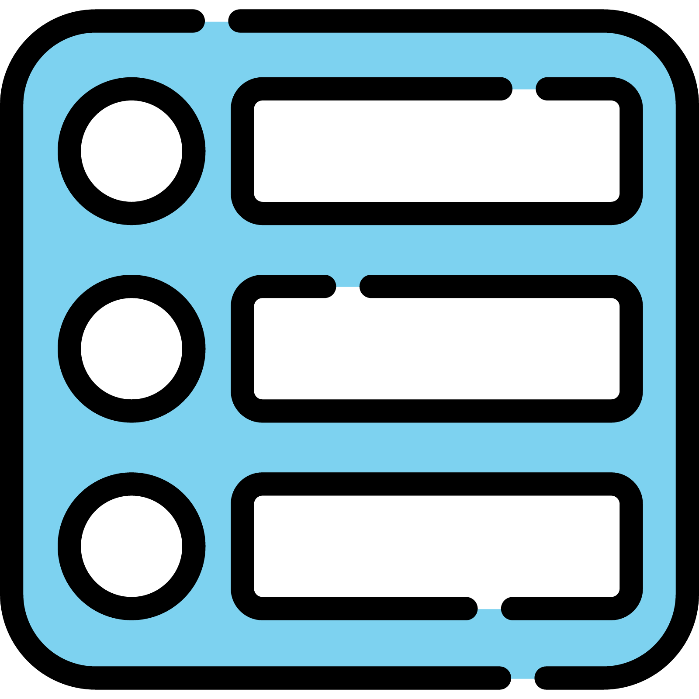
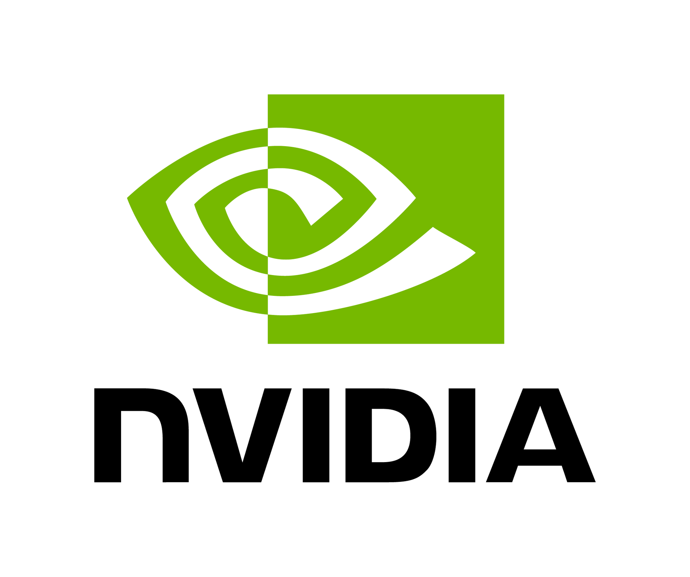
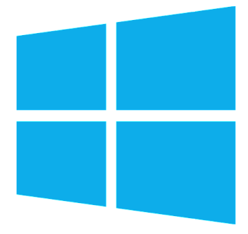

<!-- ######################################## -->
<!-- ######################################## -->
<!-- #################### IMPORTANT #################### -->
<!-- #################### IF YOU DONT HAVE ACCESS TO THE GITHUB use ctrl + shift + v TO OPEN PREVIEW USING VS CODE ONLY #################### -->
<!-- ######################################## -->
<!-- ######################################## -->
<!-- #################### INDEX #################### -->

<h2>
    
    ⠀Index
</h2>

- <a href="#jetson-installation">**Jetson Orin Nano Developer Kit**</a>
- <a href="#windows-installation">**Windows**</a>
- <a href="#raspberry-pi-installation">**Raspberry Pi**</a>
- <a href="#final-step">**Final Step (Can be run on any windows or linux device)**</a>

<br>

<!-- #################### Jetson INSTALLATION #################### -->

<h2 id="jetson-installation">
    
    ⠀Jetson Orin Nano Developer Kit
</h2>

Step 1: Copy Whisper onto Jetson Orin Nano using this command: 

```bash
git clone https://github.com/ZGMFX20AR/audio-transcription-using-openai-whisper.git
```

<br>

Step 2: Connect your USB microphone to the Jetson

<br>

Step 3: Project File Setup and Startup Configuration

### Startup Configuration
This project includes two startup configuration files that allow the application and supporting services to run automatically when the user logs into the system.

### Startup Launchers
The following .desktop files should be placed in:
```bash
~/.config/autostart/
```

<ul class="step2a">
    <li><a href="../.config autostart files/Nanospect.desktop">Nanospect.desktop</a> Launches the main NanoSpect application at login using Python.</li>
    <li><a href="../.config autostart files/bt.desktop">bt.desktop</a> Runs a Bluetooth helper script that enables automatic trusting and handling of Bluetooth connections on the Jetson device.</li>
</ul>

### Supporting Scripts
These scripts must exist in your system (location can vary depending on your setup):

<ul class="step2b">
    <li><a href="../HOME/move_bt_images.sh">move_bt_images.sh</a> Watches the Downloads folder and automatically moves image files into the project directory.</li>
    <li><a href="../HOME/bluetooth_trust.sh">bluetooth_trust.sh</a> Handles Bluetooth device trust configuration.</li>
</ul>

### Make Scripts Executable
Before they can run, you must give them execution permissions:
```bash
chmod +x /home/student/move_bt_images.sh
```

```bash
chmod +x /home/student/bluetooth_trust.sh
```

> [!NOTE]
> Replace /home/student/ with your actual system path if different.

<br>

Step 4: Download NanoSpectAITkinter.py + NanoSpectAICamera.py + NanoSpectAIMobile.py onto the Jetson Orin Nano

### Main Application for this Part
<ul class="step3b">
    <li><a href="../NanoSpectAI/NanoSpectAITkinter.py">NanoSpectAITkinter.py</a> This script is an launcher and will launcher the other two scripts.</li>

</ul>

### Supporting Scripts
These scripts are launched through <a href="../NanoSpectAI/NanoSpectAITkinter.py">NanoSpectAITkinter.py</a>:

<ul class="step3b">
    <li><a href="../NanoSpectAI/NanoSpectCamera.py">NanoSpectCamera.py</a> Script for USB camera + whisper note taking.</li>
    <li><a href="../NanoSpectAI/NanoSpectMobile.py">NanoSpectMobile.py</a> Script for Android Phone + whisper note taking.</li>
</ul>

### Required Location
```bash
~/audio-transcription-using-openai-whisper/
```

> [!NOTE]
> If the you want the the application to run on login then you need to put the <a href="../NanoSpectAI/NanoSpectCamera.py">NanoSpectCamera.py</a> and <a href="../NanoSpectAI/NanoSpectMobile.py">NanoSpectMobile.py</a> scripts into the HOME directory(at least we had to).

<br>

Step 5: Download mobile app (NanoSpectAIMobile) on your Android device and connect the device to the Jetson via Bluetooth

### Android Studio
The mobile app was made using Android Studio. To install this app, you need to download Android Studio on your computer and open this folder <a href="../NanoSpectMobile">NanoSpectMobile</a> in it. You also need to turn on Developer Mode in your Android settings with USB Debugging on.

May add direct APK later

<br>

Step 6: Boot the machine, or run either script after boot. Take pictures with Android mobile device and speak into the microphone. After finishing, press stop on the mobile app to terminate the script, or pres ESC on the Jetson if you are using the USB camera and allow the program to finish transcribing. 

<br>

<!-- #################### Windows INSTALLATION #################### -->

<h2 id="windows-installation">
    
    ⠀Windows
</h2>

Possibly Coming Soon

<br>

<!-- #################### Raspberry Pi INSTALLATION #################### -->

<h2 id="raspberry-pi-installation">
    
    ⠀Raspberry Pi
</h2>

Possibly Coming Soon

<br>

<h2 id="final-step">
    
    ⠀Final Step
</h2>

Final Step: Install all files in NanoSpectAI-UI. Into the UI, input document from inspection, along with building type, date of inspection, address, cover photo, logo, and inspector photos. 

### Important Information

These launch the interface for the final report 

<ul class="step3b">
    <li><a href="../NanoSpectAPI-UI/launch.bat">launch.bat</a> Windows devices</li>
    <li><a href="../NanoSpectAPI-UI/launch.sh">launch.sh</a> Linux devices</li>
</ul>

<br>

The program will generate a full inspection report based off of your inputted document. 
