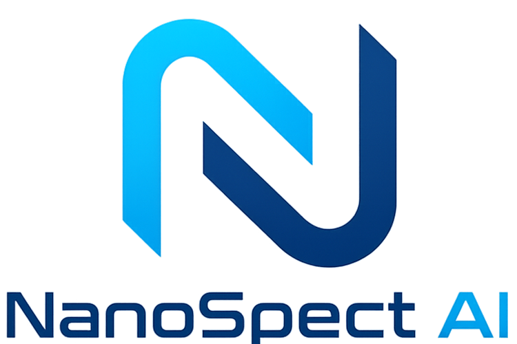

     
    

<h1 align="center" style ="font-size: 32px; font-weight: bold">Home Inspection Assistant</h1>

    <a href="#key-features">Key Features</a> •
    <a href="#installation">Installation</a> •
    <a href="#getting-started">Getting Started</a> •
    <a href="#credits">Credits</a>

<h2 id="key-features">
    
    ⠀Key Features
</h2>

<ul class="features">
    <li>Designed for the <b>Jetson Orin Nano</b>, but works with Raspberry Pi or other computers.</li>
    <li>Combines <b>Whisper AI</b> transcription with captured images into a chronologically structured word document.</li>
    <li>Supports direct <b>USB Camera</b> connection or <b>Android Phone</b> connected via Bluetooth for document embedding.</li>
    <li>Delivers detailed, guardrailed inspection results using <b>Gemini 2.5 Pro</b>.</li>
    <li>Efficient API calls designed for <b>minimal</b> token consumption and reduced latency.</li>
</ul>

<h2 id="installation">
    
    ⠀Installation
</h2>

Follow the <a href="./Assets/Installation.md">installation guide</a> to set everything up from scratch. It walks you through each step clearly, so you don’t need any previous experience. Just follow the steps in order, and you’ll have everything installed and ready to go.

<h2 id="getting-started">
    
    ⠀Getting Started
</h2>

### Material List

<ul class="gettingStarted">
    <li>Jetson Orin Nano or other computer</li>
    <li>USB Camera or Android Phone for captured images</li>
    <li>USB Mic connected to the Jetson</li>
</ul>

### Multiple Systems

> [!NOTE]
> This project has multiple systems including the note taking script that uses Whisper, the Gemini API script, and a mobile app for sending images over bluetooth. These systems are in the GitHub under the different folders check the <a href="#installation">Installation</a> guide for how to setup each system.

<h2 id="contributors">
    
    ⠀Contributors
</h2>

- **[@John-ThomasDaigle](https://github.com/John-ThomasDaigle)**: 
- **[@JoshDumas45](https://github.com/JoshDumas45)**:
- **[@Jackson2812](https://github.com/Jackson2812)**:

<h2 id="Supervisor">
    
    ⠀Supervisor
</h2>

This private project is supervised by [Dr. Ahmad Al-Shami](https://github.com/alshami10), who has repository access solely for academic guidance, review, and assessment purposes.
